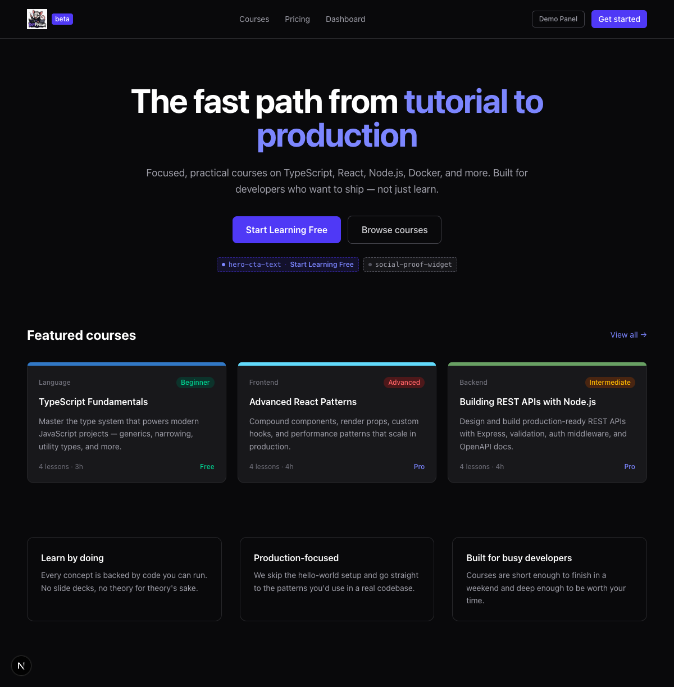
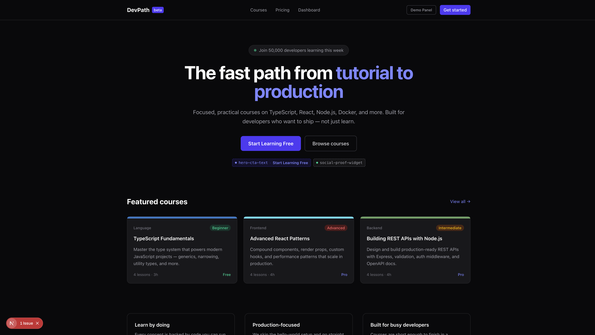
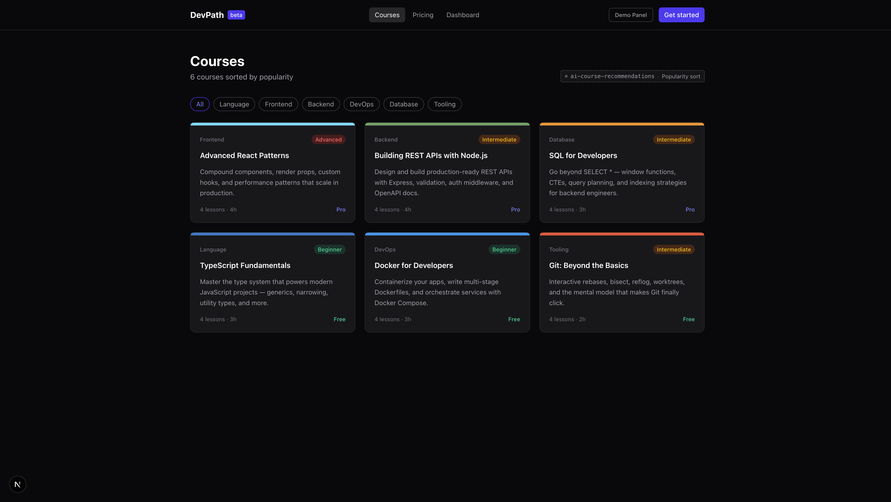
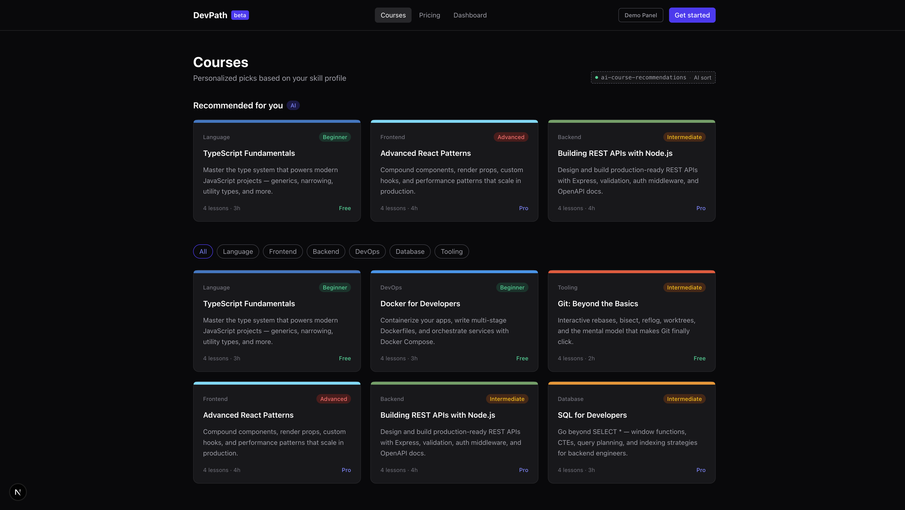
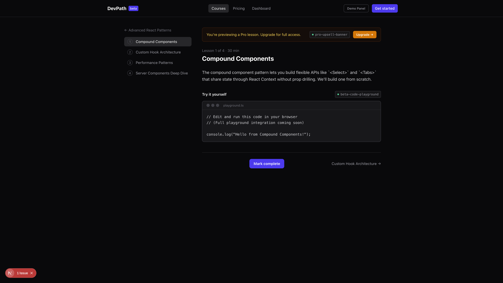
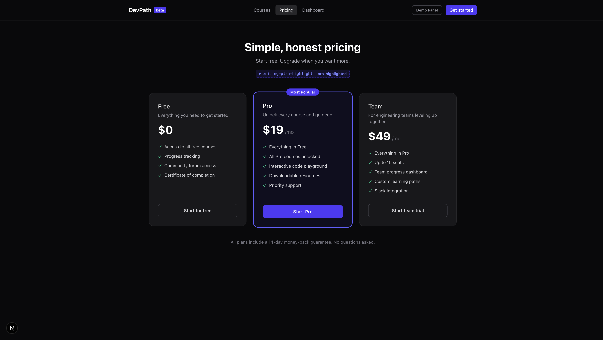
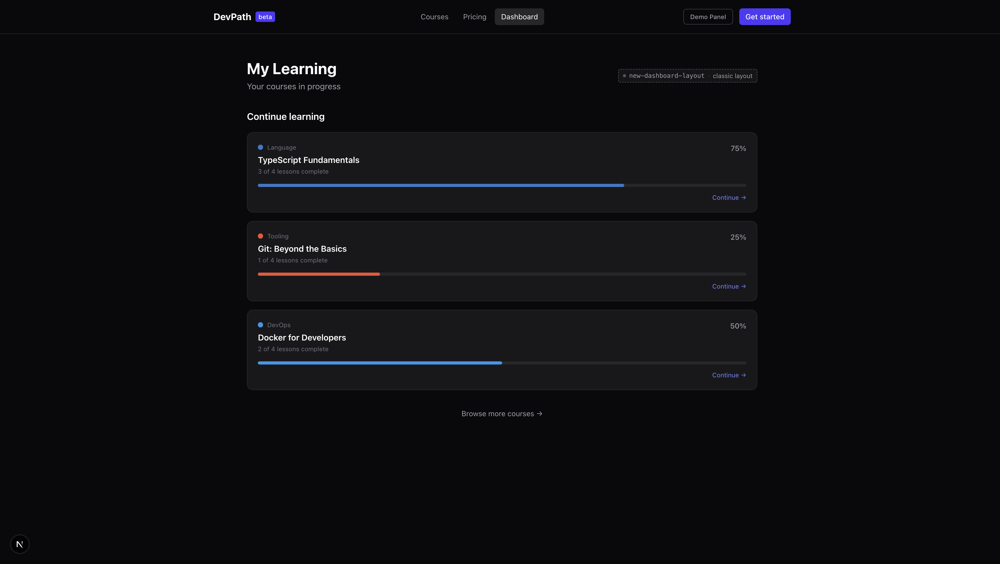
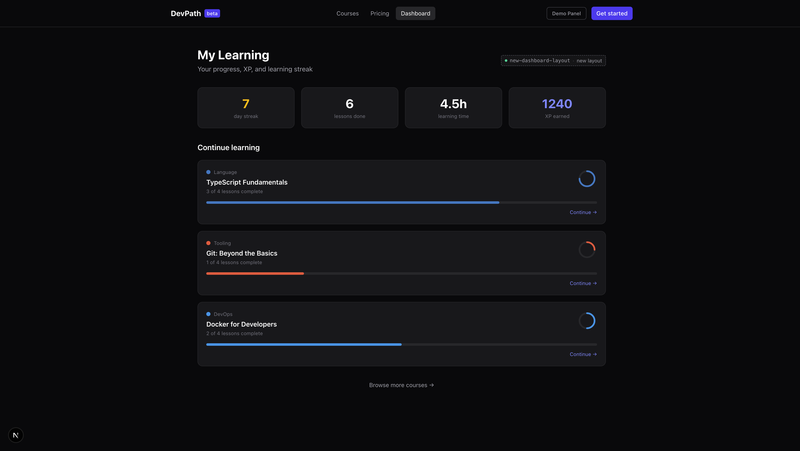
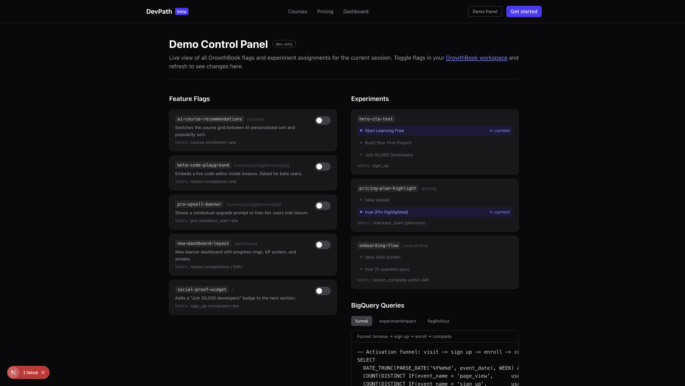

# DevPossum — Teaching & Demo Guide

DevPossum is a fictional developer-learning platform wired end-to-end to **GrowthBook** (feature flags + experiments), **GA4** (events), and **BigQuery** (analysis). This guide is the script for a live demo or blog post, and a reference for the patterns the app is meant to teach.

The emphasis is on getting the *measurement* right: where flags are evaluated, how experiment exposure is recorded, how analytics events are named, and how BigQuery joins are written. Several common-but-wrong patterns are called out explicitly under [Anti-patterns this app avoids](#anti-patterns-this-app-avoids).

> Screenshots below were captured locally with no GrowthBook key, so flags resolve to their defaults. To preview a flag's UI without a key, append `?ff=<flag-key>` (comma-separated for several) in development — e.g. `/dashboard?ff=new-dashboard-layout`. This uses GrowthBook's `setForcedFeatures`, the same mechanism the GrowthBook DevTools use.

---

## Architecture at a glance

| Concern | Where it lives | Notes |
|---|---|---|
| Anonymous id | `proxy.ts` | Stamps a stable `dp_anon_id` cookie. Edge-only; sets a cookie, does **not** render UI. |
| Feature payload | `lib/growthbook-server.ts` | Fetched once on the server, cached via `fetch` revalidation. |
| Flag/experiment evaluation | GrowthBook SDK (client), bootstrapped from server payload + id | First client render matches server HTML → no flag flicker. |
| Event tracking | `lib/analytics.ts` + `components/analytics-tracker.tsx` | One `page_view` per navigation; GA4 auto page_view disabled. |
| Exposure | `trackingCallback` in `lib/growthbook.ts` | One `experiment_viewed` per experiment, at assignment. |
| Flag telemetry | `onFeatureUsage` in `lib/growthbook.ts` | Deduped per (flag, value) per session. |
| Analysis | `BQ_QUERIES` in `lib/analytics.ts`, shown on `/demo` | Exposure-joined, timestamp-bounded, `user_pseudo_id` keyed. |

### Server vs. client evaluation (the part people get wrong)

Middleware/proxy **cannot render UI** — it runs on the Edge and can only rewrite, redirect, or set headers/cookies. So flags are *not* "evaluated in middleware to render the page." Instead:

1. `proxy.ts` stamps a stable `dp_anon_id` cookie (and forwards it to the same render so the first request is consistent).
2. The root layout (a Server Component) fetches the GrowthBook payload once (cached) and passes it + the id to the client.
3. The client SDK initializes with that same payload + id, so the first client render computes the same values the server did — no flicker, consistent bucketing.

---

## The demo, page by page

### 1. Home — the hero CTA experiment

`hero-cta-text` is a 3-way experiment on the primary CTA. Exposure fires the moment the component assigns a variant (via `trackingCallback`), **not** when the user clicks — so non-clickers stay in the denominator.



The `social-proof-widget` flag adds a credibility badge to the hero. Here it is forced on with `/?ff=social-proof-widget`:



### 2. Courses — a flag that changes content live

`ai-course-recommendations` swaps popularity sort for a personalized "Recommended for you" rail. Toggling it in GrowthBook changes the page on next load with no deploy.

| Off (default) | On (`?ff=ai-course-recommendations`) |
|---|---|
|  |  |

### 3. Lesson player — two flags at once

A Pro lesson with both `pro-upsell-banner` and `beta-code-playground` forced on (`?ff=beta-code-playground,pro-upsell-banner`). The upsell button fires GA4's recommended `begin_checkout` event.



### 4. Pricing — an experiment + ecommerce events

`pricing-plan-highlight` decides whether Pro gets the "Most Popular" treatment. Bucketing is done client-side by the anon id, so it's stable per visitor even without the server experiment definition. Selecting a plan fires `begin_checkout`; a confirmed subscription fires `purchase`.



### 5. Dashboard — the rollback story

`new-dashboard-layout` gates a richer dashboard (XP, streaks, progress rings). This is the feature in the "aha moment."

| Classic (default) | New layout (`?ff=new-dashboard-layout`) |
|---|---|
|  |  |

### 6. Demo control panel — `/demo`

A live view of every flag state, the current experiment assignment per experiment, and copy-pasteable BigQuery queries.



---

## Walkthrough script (~8 min)

1. **Set the scene** — open `/`. Point out the hero CTA; explain it's an experiment and that exposure is logged on view, not click.
2. **Live flag toggle** — flip `ai-course-recommendations` in GrowthBook, reload `/courses`. The grid changes with no deploy.
3. **Experiment assignment** — open `/demo`, show the current bucket per experiment and that it's stable across reloads (anon id).
4. **Experiment analysis** — run the `experimentImpact` query. It joins `experiment_viewed` exposures to `sign_up`, so the rate is computed over everyone exposed. Let GrowthBook judge significance rather than eyeballing a p-value.
5. **The rollback** — run `flagRollout`. The completion-rate guardrail regressed for the group that saw `new-dashboard-layout`, so toggle it off. Seconds, not a hotfix.

> **Be honest about causality.** A percentage rollout is *observational* — a guardrail regression is a signal to roll back and investigate, not a proven causal effect. For a causal read, run the feature as a GrowthBook experiment and analyze it with the exposure-join pattern.

---

## Event taxonomy (GA4)

| Event | When | Key params | Notes |
|---|---|---|---|
| `page_view` | every navigation | `page_title`, `page_location` | GA4 auto page_view is **off**; we send exactly one. |
| `sign_up` | registration | `method` | GA4 recommended event. |
| `course_view` | course detail opened | `course_id`, `category`, `is_free` | |
| `lesson_start` / `lesson_complete` | lesson lifecycle | `lesson_id`, `time_spent_seconds` | `lesson_complete` is idempotent per lesson. |
| `cta_click` | primary CTA | `cta_text`, `location` | **No variant** — exposure owns that. |
| `pricing_view` | pricing load | `highlighted_plan` | |
| `begin_checkout` | plan selected | `currency`, `value`, `items` | GA4 ecommerce. |
| `purchase` | subscription confirmed | `transaction_id`, `currency`, `value`, `items` | GA4 ecommerce. |
| `experiment_viewed` | assignment | `experiment_id`, `variation_id` | **Canonical exposure**, one per experiment. |
| `feature_flag_evaluated` | flag usage | `flag_key`, `flag_value` | Deduped per (flag, value) per session. No `user_id`. |

---

## BigQuery patterns

All queries live in `lib/analytics.ts` and are shown on `/demo`. Three rules they all follow:

- **Params are nested.** GA4 stores event parameters in a repeated `event_params` RECORD, so every read needs `UNNEST` / a scalar subquery — they are not flat columns.
- **Join on `user_pseudo_id`.** It's the export's identity key. `user_id` is only populated when explicitly set and is not the join key here.
- **Bound exposure → conversion by time, not by date equality.** A conversion on a later day than the exposure must still count, so join with `conversion_ts >= exposure_ts`, never `event_date = event_date`.

Exposure-based experiment lift (abridged from `experimentImpact`):

```sql
WITH exposures AS (
  SELECT
    user_pseudo_id,
    (SELECT value.string_value FROM UNNEST(event_params) WHERE key = 'variation_id') AS variation_id,
    MIN(TIMESTAMP_MICROS(event_timestamp)) AS first_exposure_ts
  FROM `your_project.analytics_XXXXXXXXX.events_*`
  WHERE event_name = 'experiment_viewed'
    AND (SELECT value.string_value FROM UNNEST(event_params) WHERE key = 'experiment_id') = 'hero-cta-text'
  GROUP BY user_pseudo_id, variation_id
),
conversions AS (
  SELECT user_pseudo_id, MIN(TIMESTAMP_MICROS(event_timestamp)) AS first_conversion_ts
  FROM `your_project.analytics_XXXXXXXXX.events_*`
  WHERE event_name = 'sign_up'
  GROUP BY user_pseudo_id
)
SELECT
  e.variation_id,
  COUNT(DISTINCT e.user_pseudo_id) AS exposed_users,
  COUNT(DISTINCT IF(c.first_conversion_ts >= e.first_exposure_ts, e.user_pseudo_id, NULL)) AS converted_users
FROM exposures e
LEFT JOIN conversions c USING (user_pseudo_id)
GROUP BY e.variation_id;
```

> The GA4 → BigQuery export is **not** real-time (daily `events_` tables plus a delayed `events_intraday_`). For a live demo, query a pre-seeded dataset rather than expecting the run you just clicked to appear instantly.

---

## Anti-patterns this app avoids

These are the mistakes the original concept risked teaching. Each is fixed in the code; this list is the "why."

1. **"Flags are evaluated in middleware to render the page."** Middleware/proxy can't render — it sets the `dp_anon_id` cookie. Values come from the SDK, bootstrapped from a cached server payload.
2. **Exposure piggy-backed on `page_view`/`cta_click`.** Exposure is its own `experiment_viewed` event at assignment. A user can be in several experiments at once; a single `experiment_variant` field can't represent that, and tying exposure to clicks biases the denominator.
3. **An analytics event on every flag evaluation.** `onFeatureUsage` is deduped per (flag, value) per session, and carries no `user_id`.
4. **Custom ecommerce names.** `begin_checkout` / `purchase` with `value` + `currency` + `items`, so GA4's monetization reports populate.
5. **Double-counted `page_view`.** GA4 auto page_view is disabled; one manual event per navigation, guarded against React StrictMode's double-effect.
6. **Broken BigQuery joins.** `user_pseudo_id` keys, `UNNEST` for nested params, timestamp-bounded exposure→conversion joins.
7. **Reading causal lift from a rollout.** A percentage rollout is observational; guardrail regressions are signals, and causal claims need a randomized experiment.

---

## Running it

```bash
npm install
cp .env.local.example .env.local   # optional: add GrowthBook + GA4 keys
npm run dev                         # http://localhost:3000
```

Without keys, every flag serves its default and the app is fully navigable. Add a GrowthBook client key to toggle flags live; add a GA4 Measurement ID to emit events to BigQuery.
